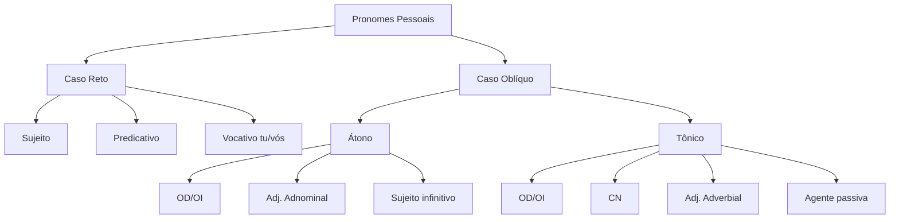

import { Callout } from 'fumadocs-ui/components/callout';
import { Step, Steps } from 'fumadocs-ui/components/steps';
import { Tab, Tabs } from 'fumadocs-ui/components/tabs';

Os **pronomes pessoais** são palavras que substituem ou acompanham os nomes, referindo-se às pessoas do discurso. Diferentemente de outras classes gramaticais com significado fixo, os pronomes ganham sentido apenas no contexto em que são usados.

<Callout type="info">
  **Exemplo contextual:** No título do filme "Que horas ela volta?", o pronome "ela" só tem significado quando descobrimos, no contexto, que se refere à mãe do garoto.
</Callout>

---

## Quadro dos Pronomes Pessoais

Os pronomes pessoais se dividem em **caso reto** e **caso oblíquo** (átono e tônico):

| Pessoa | Caso Reto | Caso Oblíquo Átono | Caso Oblíquo Tônico |
|--------|-----------|-------------------|---------------------|
| 1ª singular | eu | me | mim, comigo |
| 2ª singular | tu | te | ti, contigo |
| 3ª singular | ele/ela | o, a, lhe, se | ele, ela, si, consigo |
| 1ª plural | nós | nos | nós, conosco |
| 2ª plural | vós | vos | vós, convosco |
| 3ª plural | eles/elas | os, as, lhes, se | eles, elas, si, consigo |

### Observações importantes

<Steps>

<Step>
### Diferença entre átono e tônico

**Átono:** Pronúncia fraca, sem preposição explícita
- Exemplo: "Encontrei-**te** ontem"

**Tônico:** Pronúncia forte, sempre com preposição
- Exemplo: "Ofereceu a **ti**"
</Step>

<Step>
### Formas combinadas com preposição

Nas formas **comigo, contigo, consigo, conosco, convosco**, a preposição "com" já está incorporada no pronome.

- ✅ "Vem **comigo**!"
- ❌ ~~"Vem com mim"~~ (incorreto na norma-padrão)
</Step>

<Step>
### Plurais especiais

- **Nós** pode significar: eu + tu, eu + vós, eu + ele(s)
- **Vós** é o plural de tu, mas pode significar: tu + ele(s)
</Step>

</Steps>

---

## Funções Sintáticas dos Pronomes

### Caso Reto

Os pronomes do caso reto exercem principalmente três funções:

<Tabs items={['Sujeito', 'Predicativo do Sujeito', 'Vocativo']}>
  <Tab value="Sujeito">
    **Função mais comum do caso reto**
    
    ```
    Eu estou feliz.
    Tu mudaste a Natureza.
    Ele chegou cedo.
    ```
    
    O pronome é quem pratica ou sofre a ação verbal.
  </Tab>
  
  <Tab value="Predicativo do Sujeito">
    **Qualifica ou identifica o sujeito**
    
    ```
    O convidado é ele.
    A responsável sou eu.
    ```
    
    Conecta-se ao sujeito por um verbo de ligação.
  </Tab>
  
  <Tab value="Vocativo">
    **Chamamento (apenas tu/vós)**
    
    ```
    E tu, o que queres?
    Vós, meus amigos, escutai!
    ```
    
    Serve para invocar ou chamar o interlocutor.
  </Tab>
</Tabs>

### Caso Oblíquo Átono

Principais funções dos pronomes átonos:

| Função | Exemplo | Explicação |
|--------|---------|------------|
| **Objeto Direto** | Encontrei-**o** aqui | Complemento sem preposição |
| **Objeto Indireto** | Diga-**me** tudo! | Complemento com preposição |
| **Adjunto Adnominal** | Sujaram-**nos** a camisa | Indica posse (nossa camisa) |
| **Sujeito do infinitivo** | Mande-**as** falar | Elas = sujeito de "falar" |

### Caso Oblíquo Tônico

Funções dos pronomes tônicos:

| Função | Exemplo | Explicação |
|--------|---------|------------|
| **Objeto Direto (núcleo)** | Vi todas **elas** | Complemento direto |
| **Objeto Indireto (núcleo)** | Ela gosta de **mim** | Complemento indireto |
| **Complemento Nominal** | Tenho saudade de **ti** | Completa substantivo |
| **Adjunto Adverbial** | Comemore **comigo**! | Circunstância (companhia) |
| **Agente da Passiva** | O livro foi escrito por **mim** | Quem pratica a ação |

---

## Emprego: EU e TU

### Regra fundamental

Os pronomes **eu** e **tu** são usados quando exercem função de **sujeito**, mesmo que precedidos de preposição:

```
✅ A mãe vive dizendo pra eu arrumar o quarto.
         (eu = sujeito de "arrumar")

✅ Os políticos discursavam para eu ouvir.
         (eu = sujeito de "ouvir")

✅ Entre eu comprar e tu chorares, é melhor que eu compre.
      (eu/tu = sujeitos de "comprar" e "chorar")
```

<Callout type="warn">
  **Atenção:** Se **não for sujeito**, use os pronomes oblíquos **mim/ti**!
</Callout>

### Quando usar MIM e TI

Use os oblíquos quando **não forem sujeito**:

```
✅ Estudar foi fácil para mim.
      (Estudar = sujeito, não "mim")

✅ Entre mim e ti, restam ilusões.
      (Ilusões = sujeito, não "mim" ou "ti")

✅ Trouxeram isso para mim.
      (mim = objeto indireto)
```

### Exceções válidas

**EU e TU sem função de sujeito** são corretos em:

#### 1. Predicativo do sujeito
```
Nas minhas terras, o rei sou eu.
```

#### 2. Vocativo (apenas tu/vós)
```
Ó tu, que és forte, ajuda-me!
```

---

## Análise de Exemplo Literário

Veja o uso dos pronomes no poema de Alberto Caeiro:

```
Quando eu não te tinha
Amava a Natureza como um monge calmo a Cristo...
[...]
Tu mudaste a Natureza...
Trouxeste-me a Natureza para o pé de mim,
```

**Análise das funções:**

- **Sujeito:** "**eu** não te tinha" / "**Tu** mudaste"
- **Objeto direto:** "amo-**a** do mesmo modo" / "te **ter** e te **amar**"
- **Objeto indireto:** "Tu não **me** tiraste" (de mim) / "reparo nelas" (em + elas)
- **Adjunto adverbial:** "vou **contigo**"
- **Complemento nominal:** "para o pé de **mim**"

---

## Resumo Visual



---

## Macetes para Não Errar

<Callout type="success">
  **Dica de ouro:** Sempre que houver verbo no infinitivo depois do pronome, use **EU/TU** (são sujeitos desse verbo)!
  
  - Para **eu** fazer
  - Para **tu** estudares
  - Entre **eu** sair e você ficar
</Callout>

### Teste rápido

Substitua por "nós" ou "vocês":
- "Para **eu** viajar" → "Para **nós** viajarmos" ✅
- "Para **mim** viajar" → ~~"Para nós viajar"~~ ❌

Se funcionar com "nós/vocês", use **eu/tu**!

---

## Exercícios Práticos

### Identifique a função sintática

1. "Ela **me** contou tudo."
2. "O vencedor sou **eu**."
3. "Trouxe isso para **ti**."
4. "É necessário **eu** falar."
5. "Encontrei-**te** no parque."

<details>
<summary>Ver respostas</summary>

1. **me** = objeto indireto (contou a mim)
2. **eu** = predicativo do sujeito
3. **ti** = objeto indireto
4. **eu** = sujeito de "falar"
5. **te** = objeto direto

</details>

---

## Referência Rápida

| Situação | Use | Não use |
|----------|-----|---------|
| Sujeito de infinitivo | para **eu** ir | ~~para mim ir~~ |
| Sem ser sujeito | para **mim** | ~~para eu~~ |
| Com "com" | **comigo** | ~~com mim~~ |
| Objeto direto átono | vi-**te** | ~~vi tu~~ |
| Predicativo | sou **eu** | ~~sou mim~~ |